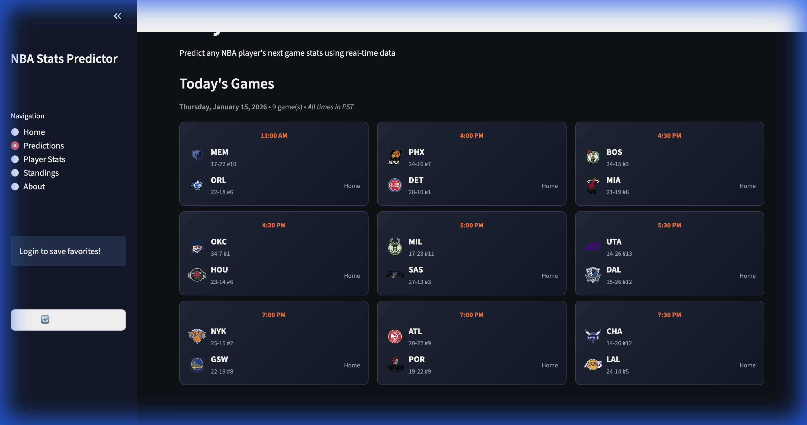

# NBA Player Stats Predictor

An advanced NBA player performance prediction app built with Streamlit, powered by Hidden Markov Models (HMM) for AI-driven stat forecasting.


## Features

### AI-Powered Player Predictions
Predict any NBA player's next game stats using a Hidden Markov Model that analyzes:
- Recent performance trends
- Opponent defensive ratings
- Head-to-head historical matchups
- Home/Away factors


### Live Game Scores
Real-time scores for today's games with:
- Final scores highlighted (winner in green)
- Live game updates during games
- Scheduled game times with team matchups



### Comprehensive Standings
Full NBA standings with advanced metrics:
- Offensive and Defensive Ratings
- Home/Away records
- Win streaks and L10 records
- Play-in tournament indicators


### Playoff Picture
Visual playoff bracket showing:
- Current seedings and matchups
- Play-in tournament scenarios
- Conference logos and team records


### Enhanced Player Profiles
Detailed player information including:
- Player headshots and team logos
- Biographical data (Age, Height, Weight, Draft info)
- Home vs Away performance splits
- Win vs Loss performance splits
- Recent game history with scores

### Favorites System
Google OAuth authentication for:
- Saving favorite players and teams
- Quick access to player predictions
- Personalized dashboard experience

## Tech Stack

- **Frontend**: Streamlit
- **ML Model**: Hidden Markov Model (hmmlearn)
- **Data Source**: NBA API (nba_api)
- **Authentication**: Google OAuth 2.0
- **Database**: SQLite

## Getting Started

### Prerequisites
- Python 3.11+
- [uv](https://docs.astral.sh/uv/) (recommended) or pip

### Installation

1. Clone the repository:
```bash
git clone https://github.com/VisveshJ/NBAPlayerStatsPredictor.git
cd NBAPlayerStatsPredictor
```

2. Install dependencies:
```bash
uv sync
```

3. Set up Google OAuth (optional, for Favorites):
   - Create a project in Google Cloud Console
   - Enable Google OAuth 2.0
   - Create credentials and add to `.streamlit/secrets.toml`:
   ```toml
   [google_oauth]
   client_id = "your-client-id"
   client_secret = "your-client-secret"
   redirect_uri = "http://localhost:8501"
   ```

4. Run the app:
```bash
uv run streamlit run app.py
```

## Project Structure

```
NBAPlayerStatsPredictor/
├── app.py                 # Main Streamlit application
├── src/
│   ├── auth/             # Google OAuth authentication
│   ├── database/         # SQLite backend for favorites
│   ├── logic/            # HMM model and prediction logic
│   └── ui/               # UI components
├── static/               # Static assets (conference logos)
├── screenshots/          # README screenshots
└── pyproject.toml        # Project dependencies
```

## How the Prediction Model Works

The app uses a **Gaussian Hidden Markov Model** with 3 hidden states representing different performance levels:

1. **State Detection**: Analyzes player's recent 5 games to identify current "hot", "average", or "cold" state
2. **Transition Prediction**: Uses learned transition probabilities to predict next game state
3. **Defensive Adjustment**: Adjusts predictions based on opponent's defensive rating
4. **H2H Weighting**: Incorporates historical performance against specific opponents
5. **Injury Filtering**: Excludes games where player played < 60% of average minutes

## License

This project is for educational and personal use.

## Acknowledgments

- [NBA API](https://github.com/swar/nba_api) for comprehensive NBA data
- [Streamlit](https://streamlit.io/) for the amazing web framework
- [hmmlearn](https://hmmlearn.readthedocs.io/) for HMM implementation
