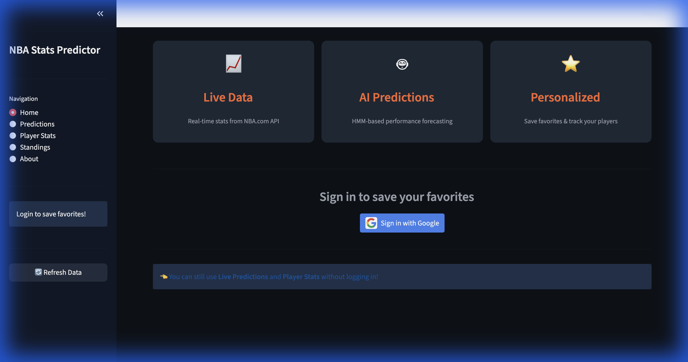

# 🏀 NBA Player Stats Predictor

An advanced, full-stack analytics platform built to provide AI-driven performance forecasting using **Hidden Markov Models (HMM)**. This application bridges the gap between raw sports data and actionable insights through a modern, responsive dashboard.



## ✨ Core Features

### 🤵 Personalized Dashboard
- **Google OAuth 2.0 Integration**: Secure login (PKCE flow) to save your personalized experience.
- **Favorites Management**: Track your favorite teams and players with a dedicated dashboard.
- **Dynamic Seeding & Records**: Real-time Western and Eastern Conference standings with color-coded streaks (Green for Wins, Red for Losses) and detailed home/away/division splits.

### 🤖 AI-Powered Predictions
- **Hidden Markov Models**: Utilizes Gaussian HMM to identify player performance states (Cold, Average, Hot) and predict future stat lines.
- **Situational Context**: Integrates Opponent Defensive Ratings (DRTG) to scale predictions based on matchup difficulty.
- **Consistency Analysis**: Calculates player volatility and performance reliability over the season.

### 📊 Comparative Analysis
- **Autocomplete Search**: Effortlessly find any active NBA player or team.
- **Head-to-Head (H2H) Filter**: Compare players specifically when they play against each other, including historical matchup logs.
- **Visual Comparisons**: Aesthetic stat overlays and head-to-head records (IND REC).

### 🏆 NBA Awards & Odds
- **Real-time Odds Scraper**: Live betting odds for MVP, DPOY, ROTY, and more, scraped directly from DraftKings via Playwright.
- **MVP Ladder**: Comprehensive view of the current MVP race with historical context and live statistical resumes.
- **Auto-Refresh**: Background workers ensure odds stay fresh within a 12-hour cycle.

### 📅 Live Scoreboard & News
- **Today's Games**: Real-time scores, channel information, and one-click **Box Score** links for every game on the slate.
- **Playoff Picture**: Dynamic visualization of First Round and Play-In Tournament matchups based on live seeding.
- **News Wire**: Continuous scrolling news ticker and headline grid directly from NBA.com.

## 🏗️ Architecture & Design

The application follows a modular, state-driven architecture designed for high data throughput and real-time responsiveness.

### 🧩 System Components
- **Data Acquisition Layer**: Orchestrates requests to the `nba-api` with robust caching (`st.cache_data`) and `Playwright` for browser automation.
- **AI Processing Engine**: A custom implementation of Gaussian HMM that maps observable statistics to hidden performance states.
- **Presentation Layer**: A premium dark-themed UI (Hex `#161B22`) utilizing custom CSS tokens, smooth transitions, and circle-free logo styling.
- **Persistence**: **SQLite** backend stores user preferences, favorite lists, and cached leaderboard data.

## 🤖 Predictive Modeling (The HMM Approach)
Unlike simple regressions, this app treats a player's season as a sequence of transitions between internal performance states.
- **State Selection**: Automatically identifies hidden states from recent game sequences.
- **Situational Adjustments**: 
    - **Defensive Weighting**: Predictions are scaled based on the target team's Defensive Rating.
    - **H2H Integration**: Matches against specific opponents are blended with the model output (weighted up to 40%).
    - **Injury Filtration**: Excludes "noise" games (low minutes) to maintain model integrity.

## 🖥️ Tech Stack
- **Languages**: Python 3.11+
- **ML Frameworks**: `hmmlearn`, `scikit-learn`, `numpy`, `pandas`
- **Frontend**: `Streamlit`, `Vanilla CSS (Modern Dark Theme)`
- **Automation**: `Playwright` (Chromium Headless Shell)
- **Database**: `SQLite`
- **Auth**: `Google Cloud Console (OAuth 2.0 + PKCE)`

## 🏁 Getting Started

### Prerequisites
For Linux/Cloud environments (like Streamlit Cloud), ensure the system libraries in `packages.txt` are installed to support Playwright.

### Installation
```bash
# 1. Clone & Enter
git clone https://github.com/VisveshJ/NBAPlayerStatsPredictor.git
cd NBAPlayerStatsPredictor

# 2. Install Dependencies
pip install -r requirements.txt

# 3. Initialize Playwright (Required for Odds Scraper)
playwright install chromium

# 4. Launch Application
streamlit run app.py
```

### Configuration
Update `.streamlit/secrets.toml` with your Google Cloud credentials for OAuth functionality.

## 📜 License
This project is for educational and personal use. Special thanks to the `nba-api` contributors and the Streamlit community.
